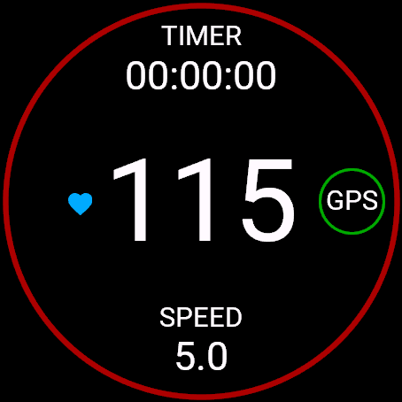
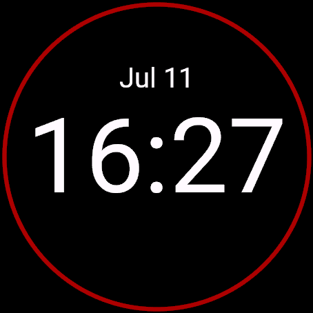

# Sail app

This is a Sailing app for garmin devices.

## Installation to device

- Find the right version of the app from build folder
- Connect your watch with computer using the data cable
- Copy `.prg` file to your watch folder `GARMIN/Apps`
- Now you can disconnect your watch from computer and you are ready to go

---

Main view             |  Clock view
:---:|:---:
  |  
