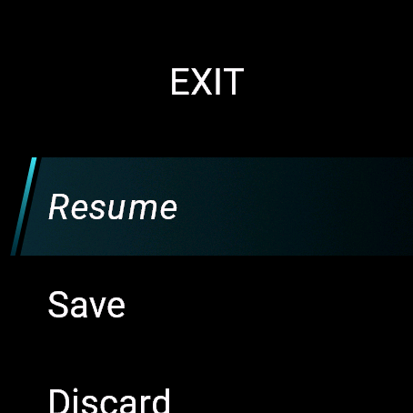

# Sail app

This is a Sailing app for garmin devices.

## Installation to device

- Find the right version of the app from build folder
- Connect your watch with computer using the data cable
- Copy `.prg` file to your watch folder `GARMIN/Apps`
- Now you can disconnect your watch from computer and you are ready to go

## How to use

Main view | Clock view | Exit menu
:---:|:---: | :---:
 |  | 

- Long press **START** key to start/stop activity
- Use **UP** and **DOWN** keys to switch between **Main** and **Clock** view
- Use **BACK** key to add laps to session

> [!NOTE]
> Touch screen functionality is only enabled in the exit menu
